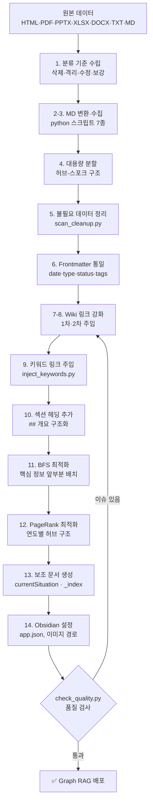
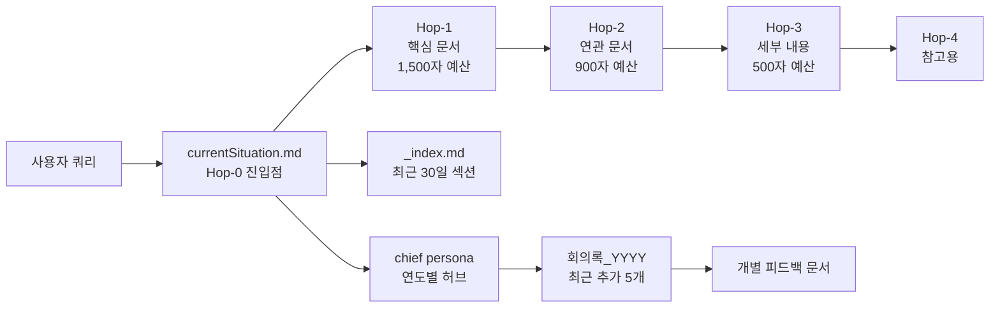

**Graph RAG**

**데이터 정제 매뉴얼**

*Obsidian Vault 기반 지식 그래프 품질 향상 통합 가이드*

*외부 데이터 수집 · 변환 · 정제 · 링크 강화 · 품질 관리 · 자동 오류 수정
전 과정을 다룬다.*

v3.23 \| 2026-03-19

---

## 목차

| § | 섹션 | 주요 내용 |
|---|------|-----------|
| 1 | 개요 | 핵심 판단 기준, 적용 환경, 품질 지표 |
| 2 | 파이프라인 전체 흐름 | 14단계 순서도 + Mermaid 다이어그램 |
| 3 | 데이터 분류 기준 | 삭제·격리·수정·보강 기준, 스텁 판단, archive 절차 |
| 4 | 원본 파일 → MD 변환 | HTML·PDF·PPTX·XLSX·DOCX·TXT·MD 7종 처리 |
| 5 | 대용량 문서 분할 | 허브-스포크 구조, 분할 기준·절차 |
| 6 | 프론트매터 통일 | 필드 정의, type/status/tags 분류 |
| 7 | Wiki 링크 1차 강화 | 클러스터·제목 매칭·ghost 링크 주입 |
| 8 | Wiki 링크 2차 강화 | 도메인 허브·계층·ghost→real·fallback |
| 9 | 키워드 링크 주입 | KEYWORD_MAP, placeholder, 빈도 감시 |
| 10 | 섹션 헤딩 및 BFS 최적화 | Passage-level retrieval, 문서 앞부분 배치 |
| 11 | PageRank 최적화 | 연도별 허브 구조, chief 태그 자동화 |
| 12 | 이미지 링크 관리 | 파일명 규칙, Obsidian 설정, 깨진 링크 |
| 13 | 품질 감사 및 자동 수정 | check_quality.py, audit_and_fix.py |
| 14 | 보조 문서 생성 | currentSituation.md, _index.md |
| 15 | Obsidian 설정 | app.json, attachmentFolderPath |
| 16 | 품질 체크리스트 | 전체 완료 후 점검 항목 |
| 17 | 운영 가이드 | 신규 문서 추가, 정기 정제, 스크립트 목록, **롤백**, **멀티 유저** |
| 18 | Graph RAG 최신성 버그 대응 | 원인 진단, 해결책, date 오염(Confluence) |
| 19 | AI 보조 정제 시 컨텍스트 대응 | 세션 재시작, 이어받기 프롬프트 |
| 20 | 매뉴얼 관리 & 업데이트 절차 | 버전 규칙, MD→DOCX 동기화 |
| — | 변경 이력 | v1.0 ~ v3.23 |

---

> **1. 개요**

Graph RAG(Retrieval-Augmented Generation)는 문서 간 연결 구조(그래프)를
활용하여 관련 컨텍스트를 탐색한다. 원본 데이터를 그대로 투입하면 고립
노드·중복 문서·의미 없는 허브가 생겨 검색 품질이 크게 저하된다. 본
매뉴얼은 이를 체계적으로 해소하는 단계별 방법론을 기술한다.

**1.1 핵심 판단 기준**

> **\"AI가 이 문서를 읽으면 현재 의사결정에 도움이 되는가?\"**

이 질문을 기준으로 모든 문서의 보존·삭제·수정을 판단한다.

**1.2 적용 환경**

  ----------------- ----------------------------------------------------
  **항목**          **내용**
  지식 베이스       Obsidian Vault (Markdown 파일)
  원본 소스         사내 위키, Confluence, Notion, 외부 참고 사이트 등
  그래프 RAG 엔진   Rembrandt Map 또는 동등 Graph RAG 시스템
  링크 형식         Wikilink \[\[문서명\]\] / !\[\[이미지명\]\]
  ----------------- ----------------------------------------------------

**1.3 핵심 품질 지표**

  --------------------- --------------------- -----------------------------------------
  **지표**              **의미**              **목표**
  링크 없는 파일 비율   고립 노드 비율        0% (목표)
  평균 인바운드 링크    허브 집중도           ghost 노드 아닌 실제 콘텐츠 파일에 집중
  섹션 헤딩 보유 비율   Passage 분할 가능성   99% 이상 (미달 시 Passage 검색 불가)
  문서 평균 글자 수     정보 밀도             300자 미만 단독 파일 없도록
  --------------------- --------------------- -----------------------------------------

> **2. 파이프라인 전체 흐름**

아래 14단계를 순서대로 수행한다. 각 단계는 이전 단계의 결과물에
의존한다.

  ---------- ----------------------------- ----------------------------------------------------
  **단계**   **작업**                      **목적**
  1          데이터 분류 기준 수립         삭제·격리·수정·보강 기준 정의
  2          원본 파일 → MD 변환            HTML·PDF·PPTX·XLSX·DOCX·TXT·MD 전 형식을 Obsidian 호환 마크다운으로 변환
  3          외부 데이터 수집·변환         텍스트/이미지 추출, 노이즈 제거, 스캔본 OCR
  4          대용량 문서 분할              허브-스포크 구조로 대형 문서를 분할
  5          불필요 데이터 정리            중복·빈 문서 삭제 또는 아카이브 이동
  6          프론트매터 통일               date·type·status·tags 전체 정규화
  7          Wiki 링크 1차 강화            클러스터·제목 매칭·ghost 링크 주입
  8          Wiki 링크 2차 강화            허브 링크·계층 링크·ghost→real·fallback 링크
  9          키워드 링크 주입              핵심 키워드 첫 등장 → 허브 파일 wikilink 자동 교체
  10         섹션 헤딩 추가                Passage-level retrieval을 위한 \#\# 헤딩 구조화
  11         BFS 최적화                    문서 앞부분에 핵심 정보 배치
  12         PageRank 최적화               실제 콘텐츠 허브에 인바운드 링크 집중
  13         보조 문서 생성                currentSituation · 인덱스 · 조직 문서
  14         Obsidian 설정 & 이미지 경로   app.json, basename 정규화
  ---------- ----------------------------- ----------------------------------------------------

**2.1 파이프라인 흐름도 (Mermaid)**

**2.2 BFS 탐색 흐름도 (Mermaid)**

